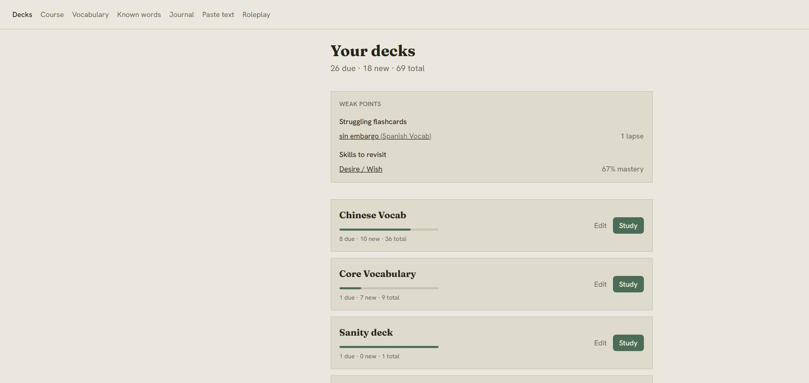
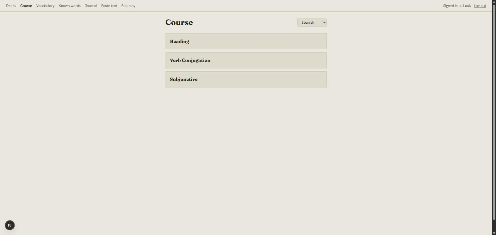
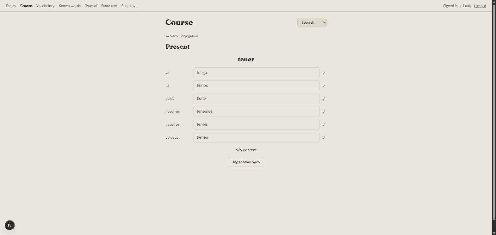
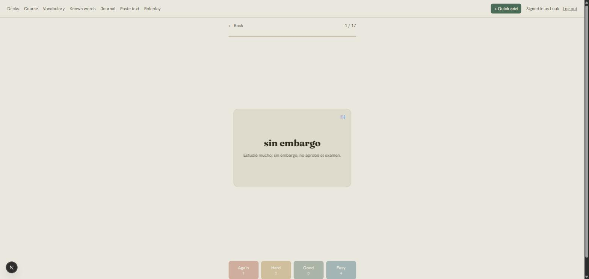
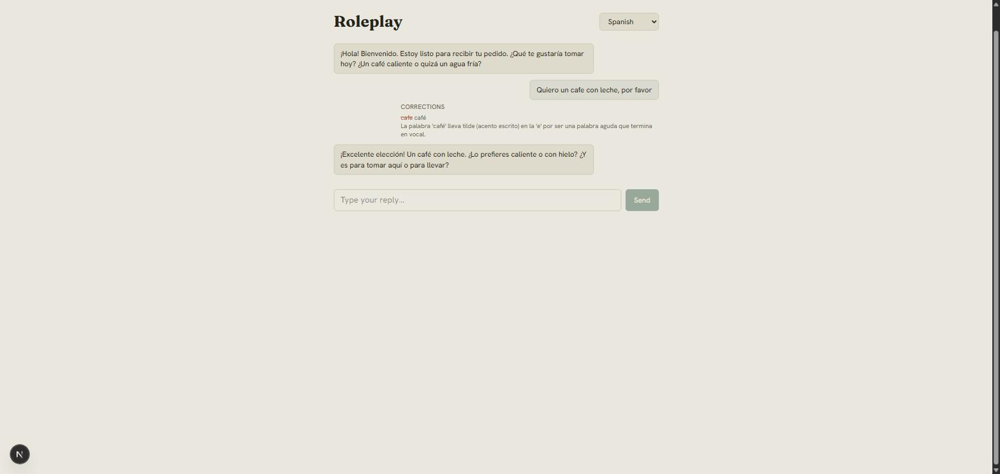
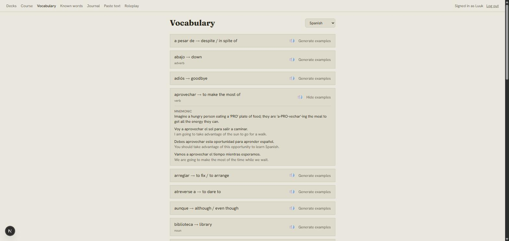
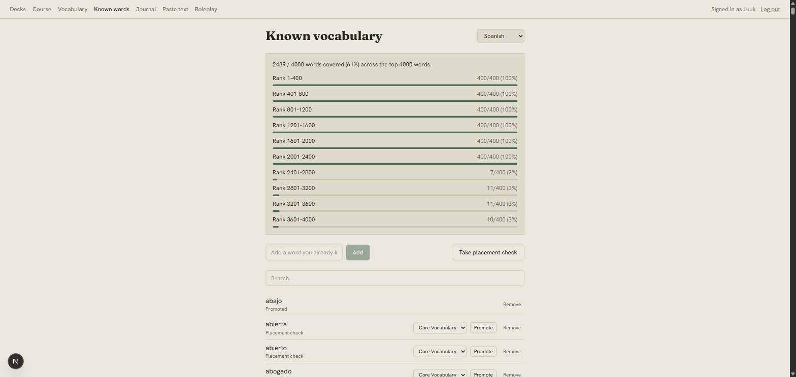

# Language App

A language learning app combining an Anki-style spaced-repetition
flashcard system (real FSRS scheduling, not a toy SM-2) with a
Duolingo-style structured course, layered with LLM-powered features —
example generation, mnemonics, free-text grading, a conversational
practice partner, journal correction with auto vocabulary extraction, and
adaptive weak-point targeting. Built as a portfolio project, so
architecture and code quality matter as much as the finished product.

First language pair: English (base) → Spanish (target), with a second
English → Dutch course built specifically to prove the app's core design
principle (below) actually holds.

## Core design principle: language-agnostic by design

`Language` is a data row, not a code branch — nowhere in the app does
`if language == "spanish"` exist. Grammar-specific logic (conjugation
tables, gendered nouns, perfect-tense auxiliary choice, pronoun labels)
lives in a per-language `grammar_config` read at runtime. LLM prompts are
templated with the target/base language as variables, never hardcoded
into a prompt string. Spanish still gets real depth — a dedicated verb
conjugation drill and a three-category subjunctive-usage module, both
things Duolingo does badly — but that depth is config-driven, not a
special case in the code.

## Features

- **Spaced-repetition flashcards** — real FSRS-6 scheduling (the
  `fsrs` package, not a hand-rolled approximation), same-session
  requeuing for lapsed cards, dual-direction cards for languages that
  need them (e.g. Chinese recognition + production), daily new-card
  caps, quick-add from anywhere in the app.
- **Structured course** — an ordered skill path per language with
  interleaved exercise types (multiple choice, translation,
  fill-in-blank), plus two Spanish-specific modules: a verb conjugation
  drill covering 17 verbs across 6 tenses/moods, and a three-trigger
  subjunctive-usage section ("spot the trigger": doubt, desire/wish,
  emotion) — a deliberate gap-fill versus Duolingo's own subjunctive
  coverage.
- **AI-powered vocabulary** — LLM-generated example sentences and
  mnemonics per word (Google Gemini), cached after first generation so
  each word only ever costs one real API call.
- **Journal correction** — write freely in the target language, get
  LLM correction with explanations, unknown words auto-extracted into
  your personal vocabulary.
- **Conversational practice partner** — multi-turn roleplay scenarios
  (ordering coffee, checking into a hotel, ...) constrained to your own
  known vocabulary, with in-context correction on every message you
  send.
- **Reading & coverage tools** — paste in any text for instant
  known/unknown word highlighting, generate reading passages from your
  own known vocabulary, and a CEFR/HSK-style coverage-gap panel showing
  exactly which frequency-band words you're still missing.
- **Adaptive weak-point targeting** — a dashboard panel blending FSRS
  lapses, exercise accuracy, and skill mastery into a ranked list of
  what to review next.
- **Real multi-user auth** — Google Sign-In, session-derived identity
  on every route, per-user data isolation and ownership checks, per-user
  rate limiting on every LLM-backed endpoint.
- **Text-to-speech** — Google Cloud TTS audio on vocabulary cards.

See [PLAN.md](./PLAN.md) for the full build plan, every architectural
decision (and why), and a running log of real bugs found and fixed along
the way.

## Screenshots

| | |
|---|---|
|  Dashboard — due/new counts, weak points, deck list |  Course — practice categories per language |
|  Verb conjugation drill — all 6 persons, one verb, graded |  FSRS review session with example sentence + audio |
|  Roleplay partner — in-context correction on a real mistake |  LLM-generated mnemonic + example sentences |
|  CEFR-style coverage-gap analysis | |

## Architecture

```
┌──────────────────┐        HTTPS, credentialed          ┌───────────────────┐
│   Next.js (TS)    │ ───────────────────────────────────▶│   FastAPI (async)  │
│  React + Tailwind  │◀─────────────────────────────────── │  SQLAlchemy 2.0    │
│  TanStack Query     │        JSON + session cookie        │                    │
└──────────────────┘                                       └─────────┬──────────┘
     Vercel                                                          │
                                                            ┌─────────┼──────────┐
                                                            ▼         ▼          ▼
                                                     ┌──────────┐ ┌────────┐ ┌─────────┐
                                                     │ Postgres │ │ Gemini │ │ Cloud TTS│
                                                     └──────────┘ └────────┘ └─────────┘
                                                       Railway     Google AI    Google Cloud
```

- **Backend** — FastAPI, async SQLAlchemy 2.0 (no legacy `Query` API),
  Alembic migrations, Postgres. A `services/` layer holds business logic
  (FSRS scheduling, conjugation generation, exercise grading, the LLM
  provider abstraction) so routers stay thin.
- **Frontend** — Next.js (App Router) + TypeScript, Tailwind, TanStack
  Query for server state. Mobile-first.
- **LLM layer** — provider-agnostic (`LLMProvider` protocol), Google
  Gemini as the only implementation today; swapping in another provider
  is meant to be additive, not a rewrite.
- **Auth** — Google Sign-In (ID-token flow, no client secret needed), a
  signed session JWT in an `httponly` cookie, every route deriving "who's
  asking" from that cookie rather than a client-supplied user ID.
- **SRS** — the official `fsrs` PyPI package (FSRS-6), pinned below
  FSRS-7 deliberately since a future major version could change scoring
  semantics, not just the API.

## Tech stack

| Layer | Choice |
|---|---|
| Backend | FastAPI, async SQLAlchemy 2.0, Alembic, Postgres |
| Frontend | Next.js, TypeScript, Tailwind CSS, TanStack Query |
| Spaced repetition | FSRS-6 (`fsrs` package) |
| LLM | Google Gemini (free tier), behind a provider-agnostic service layer |
| Text-to-speech | Google Cloud Text-to-Speech |
| Auth | Google Sign-In, session JWT |
| Testing | pytest (backend), Vitest + React Testing Library (frontend) |
| Deployment | Vercel (frontend) + Railway (backend + Postgres) |

## Getting started (local dev)

Requires Docker (for Postgres + the API) and Node.js 20+ (for the
frontend).

```bash
git clone <this repo> && cd language_app
cp .env.example .env               # repo root — fill in GEMINI_API_KEY etc.
docker compose up -d postgres
docker compose up -d --build backend
docker compose exec backend alembic upgrade head

cd frontend
cp .env.example .env.local
npm install
npm run dev                        # http://localhost:3000
```

API docs (interactive): http://localhost:8000/docs · health check:
http://localhost:8000/health

Google Sign-In, Gemini, and Cloud TTS each need their own free-tier setup
(API key or OAuth client) — every required variable, and where to get it,
is documented inline in `.env.example`.

### Tests

```bash
docker compose exec backend pytest      # backend
cd frontend && npm run test             # frontend
```

## Deployment

Deployed as two independent services: the frontend on **Vercel**, the
backend + Postgres on **Railway**. Both have generous free/hobby tiers
that don't need a credit card to start with. This walkthrough assumes
neither account exists yet.

### 1. Backend + database (Railway)

1. Create an account at [railway.app](https://railway.app), signing in
   with GitHub.
2. **New Project → Deploy from GitHub repo** → select this repo.
3. Delete the service Railway auto-creates from the repo root (it'll try
   to build the whole monorepo) — you'll add the backend as its own
   service pointed at a subdirectory instead: **+ New → GitHub Repo** →
   same repo again → in that service's **Settings → Source**, set
   **Root Directory** to `backend`. Railway will pick up
   `backend/railway.json` automatically, which points the build at
   `Dockerfile.prod` (a separate, production-hardened image from the one
   `docker-compose.yml` uses for local dev — no `--reload`, no dev
   dependencies, multi-stage build, non-root user).
4. **+ New → Database → Add PostgreSQL** in the same project.
5. On the backend service, open **Variables** and set:

   | Variable | Value |
   |---|---|
   | `DATABASE_URL` | The Postgres service's `DATABASE_URL` (Variables tab of the Postgres service), with the scheme changed from `postgresql://` to `postgresql+asyncpg://` |
   | `ENVIRONMENT` | `production` |
   | `SECRET_KEY` | A real random secret — generate one locally with `python -c "import secrets; print(secrets.token_urlsafe(48))"` and paste the output. Never reuse the local dev default. |
   | `LLM_PROVIDER` | `gemini` |
   | `GEMINI_API_KEY` | Your key from [aistudio.google.com/apikey](https://aistudio.google.com/apikey) |
   | `GOOGLE_OAUTH_CLIENT_ID` | Same OAuth client ID used locally (see `.env.example` for how to create one) |
   | `GOOGLE_APPLICATION_CREDENTIALS_JSON` | The full contents of your `gcp-tts-credentials.json`, pasted as one value — Railway has no file-upload secret, so `docker-entrypoint.sh` writes this to a file at container start instead |
   | `FRONTEND_ORIGIN` | Leave a placeholder for now (e.g. `https://localhost`) — comes back once the Vercel URL exists in step 3 |

6. Deploy. Once it's live, open a shell against the service (service's
   **⋮ menu → Shell** in the Railway dashboard) and run:

   ```bash
   alembic upgrade head
   ```

   (Migrations are applied manually here too, on purpose — see
   `PLAN.md`'s 2026-08-12 decision log entry.)
7. **Settings → Networking → Generate Domain** to get a public URL, e.g.
   `language-app-backend-production.up.railway.app`. This is your
   backend URL for the next step.

### 2. Frontend (Vercel)

1. Create an account at [vercel.com](https://vercel.com), signing in
   with GitHub.
2. **Add New → Project** → import this repo.
3. Set **Root Directory** to `frontend` (Vercel auto-detects Next.js from
   there — no other config needed).
4. Add environment variables:

   | Variable | Value |
   |---|---|
   | `NEXT_PUBLIC_API_URL` | `https://<your-railway-backend-domain>` (from step 1.7) |
   | `NEXT_PUBLIC_GOOGLE_CLIENT_ID` | Same OAuth client ID as the backend |

5. Deploy. Note the resulting URL, e.g. `https://language-app.vercel.app`.

### 3. Wire the two together

1. Back on Railway, set the backend's `FRONTEND_ORIGIN` variable to the
   real Vercel URL from step 2.5 (no trailing slash) and redeploy —
   CORS only ever allows this one literal origin, not a wildcard, so it
   has to be exact.
2. In [Google Cloud Console](https://console.cloud.google.com) →
   **APIs & Services → Credentials** → your OAuth 2.0 client → add the
   Vercel URL under **Authorized JavaScript origins**.
3. Visit the Vercel URL and sign in with Google to confirm everything's
   wired correctly end-to-end.

**Known limitation, accepted deliberately:** CORS is pinned to one exact
origin, so Vercel *preview* deployments (a different random URL per
branch/PR) won't be able to reach the backend — only the production
domain set in `FRONTEND_ORIGIN` works. Fine for a single-deployment
portfolio project; would need `allow_origin_regex` if preview deploys
ever needed to hit a real backend too.

## Project structure

- `backend/` — FastAPI app (`app/api` routers, `app/services` business
  logic, `app/models`/`app/schemas`, Alembic migrations)
- `frontend/` — Next.js app (App Router, `src/components`, `src/hooks`,
  `src/lib/api`)
- `docker-compose.yml` — local dev: Postgres + backend (with hot reload)
- `docs/screenshots/` — images used above
- `PLAN.md` — full build plan, decisions log, and current status

## License

MIT — see [LICENSE](./LICENSE).
